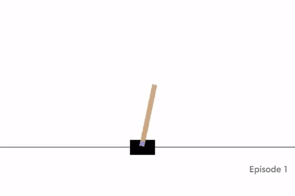

# ai-bots

Implementation of several AI and RL algorithms in Python. Evaluation on OpenAI Gym environments. 

## Implemented Algorithms

- [Naive Policy Gradient](https://github.com/amoudgl/ai-bots/blob/master/cartpole/cartpole_naive_pg.py)
- [Monte Carlo Policy Gradient with REINFORCE](https://github.com/amoudgl/ai-bots/blob/master/cartpole/cartpole-pg.py)
- [Deep Q-Learning with Experience Replay](https://github.com/amoudgl/ai-bots/blob/master/cartpole/cartpole_dqn_exp_replay.py)
- [Simulated Annealing](https://github.com/amoudgl/ai-bots/blob/master/cartpole/cartpole_simulated_annealing.py)
- [Hill Climbing](https://github.com/amoudgl/ai-bots/blob/master/cartpole/cartpole-hill-climbing.py)
- [Random Guess](https://github.com/amoudgl/ai-bots/blob/master/cartpole/cartpole-random-guess.py)
